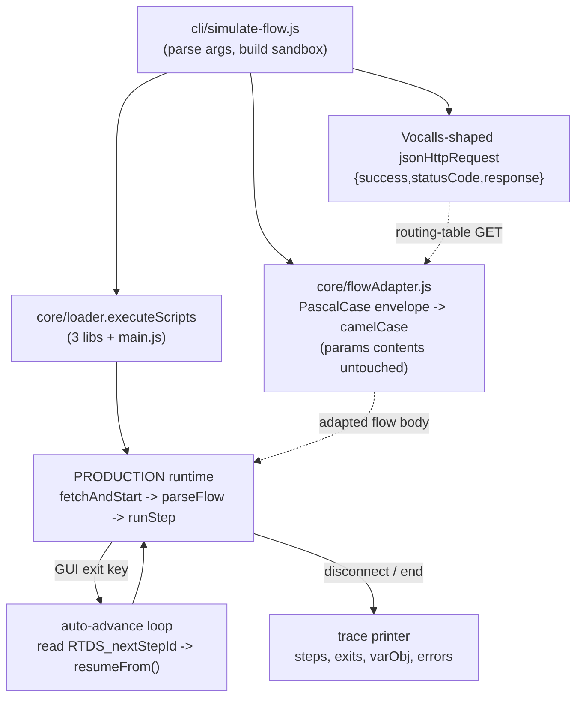

# feat: RTDS flow simulator (run production runtime, mock API + GUI handoffs)

## Summary

Add a standalone `cli/simulate-flow.js` that drives the **production** RTDS runtime
(`main.js` → `fetchAndStart` → `parseFlow` → `runStep` → `resumeFrom` → the JS handlers)
end-to-end against a real `callflow_json_config_vocalls/*.json` flow file, mocking only
the two external boundaries — outbound HTTP and GUI handoffs — and printing a readable
trace. A small reusable flow-adapter module bridges the authoring-format flow files into
the runtime/API shape. This retires the throwaway `tmp_sim_flow.js` harness.

---

## Problem Frame

There is no first-class way to run a routing-table flow through the runtime locally; the
existing `npm run simulate` stubs HTTP in a fetch-shaped response that the RTDS runtime
cannot consume, so the one universal call (the routing-table fetch) can't be mocked
usefully. The recurring cost is a hand-rebuilt throwaway Node harness (see origin:
docs/brainstorms/rtds-flow-simulator-requirements.md).

---

## Requirements

- R1. Run production runtime + handler code unmodified (no fork/re-implementation of dispatch logic).
- R2. Mock only two boundaries: outbound API requests and GUI handoffs; everything else runs real.
- R3. Provide a `jsonHttpRequest` in the Vocalls result shape (`{ success, statusCode, response }`).
- R4. The chosen flow file IS the routing-table mock; other endpoints resolve to per-URL fixtures or a generic success default.
- R5. A named, tested flow adapter converts authoring-format flow files into the runtime shape, logging that it ran and failing loudly on malformed input.
- R6. At a GUI exit, record the handoff and auto-advance via `resumeFrom()` on the op's default NextStep — deterministic, no human input.
- R7. Emit a readable trace: steps visited, exit keys, varObj writes, handoffs, and error-level logs.

**Origin actors:** A1 (developer), A2 (RTDS runtime under test), A3 (simulator harness / mock boundary)
**Origin flows:** F1 (simulate a flow end-to-end)
**Origin acceptance examples:** AE1 (covers R1, R3, R4, R5), AE2 (covers R6), AE3 (covers R5), AE4 (covers R7)

---

## Scope Boundaries

- Not running the real mxGraph canvas components — GUI handoffs are mocked at the exit-key boundary only.
- Auto-advance on default NextStep only; no scripted/interactive branch selection (deferred).
- Not modifying the production runtime or the flow files to resolve the casing gap — the adapter bridges them; `parseFlow` stays as-is (verified correct against the production Swagger).
- Not replacing `cli/simulate.js` (CONFIG/prompt simulation) — this is a separate RTDS flow-dispatch tool.
- **Adapter scope correction (per user):** the adapter lowercases only the *structural/envelope* keys the runtime reads by exact name; the contents of each `params` object stay PascalCase.

### Deferred to Follow-Up Work

- Fixing/retiring the core `stub` mode (`core/minimalVocallsCore.js`) to emit the Vocalls shape and reuse `stubs/`: separate change. This plan supplies its own mock and leaves the core stub mode untouched.
- Scripted per-op outcomes / interactive DTMF branch selection: future iteration.

---

## Context & Research

### Relevant Code and Patterns

- `cli/simulate.js` — arg-parsing + loader plumbing pattern to mirror for the new CLI (project resolution, `ensureProjectRoot`, help text).
- `core/loader.js` (`executeScripts`, `loadEnvConfig`, `loadProjectConfig`) — loads the three libraries + `main.js` in dependency order into a VM sandbox.
- `vocalls_session_init/vocallsContext.js` (`createDefaultSeed`, `buildSessionContext`) — session seed + sandbox build; same path `core/testHelpers.js` uses.
- `core/testHelpers.js` — reference for installing a custom `jsonHttpRequest` on the sandbox and capturing logs; note its stub returns the *wrong* (fetch) shape — the new mock must return `{ success, statusCode, response }`.
- `projects/rtds-runtime/globalLibraries/active/rtds_2_runtime.js`:
  - `fetchAndStart` — GETs the routing table; expects `jsonHttpRequest(url, {method}, headers).withTimeout(n).then(...)` resolving to `{ success:true, statusCode:200, response:<flowBody> }`; reads `result.response`.
  - `parseFlow` / `buildOpIndex` / `getFirstOperation` — read camelCase structural keys: `json.operations`, `json.sourceId`, `op.id`, `op.type`, `op.isFirstOperation`, `op.params`.
  - `prepareGuiHandoff` — already writes the default next step to `context.session.variables.RTDS_nextStepId` (via `resolveNextStep`). The auto-advance loop reads that.
  - `runStep` returns an exit-key string at a GUI op; `resumeFrom(nextStepId)` re-enters.
- `getParam` / `getValue` / `setupConfig` — read param keys **case-insensitively**, which is why `params` contents can stay PascalCase.
- `rtds/api_swagger/routingtable_rtds_swagger.json` (`RoutingTableFullViewModel`) — production routing-table response is camelCase; confirms `parseFlow` is correct and the adapter direction is authoring→runtime.

### Institutional Learnings

- Memory: "RTDS HTTP result shape" — `jsonHttpRequest` resolves to `{ success, response }`; use `result.response`, not `.body`. The mock must follow this.

### External References

- None needed — fully grounded in local patterns.

---

## Key Technical Decisions

- **Standalone `cli/simulate-flow.js`** rather than a flag on `cli/simulate.js`: keeps RTDS flow-dispatch separate from CONFIG/prompt simulation and keeps the RTDS-shaped HTTP mock + adapter self-contained (chosen by user).
- **Flow adapter is its own module** (`core/flowAdapter.js`), not CLI-private: reusable by anything ingesting `callflow_json_config_vocalls/*` exports; independently unit-testable (origin deferred Q).
- **Adapter converts structural keys only; `params` contents stay PascalCase** (user correction): maps `SourceId/Name/Project/PromptLibrary/SupportedLanguages/Operations` and per-op `Id/Type/Name/IsFirstOperation/Params` to their camelCase/lowercase runtime names; does NOT touch keys inside `params`. Keeps simulated `op.params` faithful to what production/dictionary emit.
- **Auto-advance reads `RTDS_nextStepId`** set by the production `prepareGuiHandoff`, then calls the real `resumeFrom()` — no op re-parsing, uses existing runtime handoff state (origin deferred Q resolved).
- **Vocalls-shaped HTTP mock supplied by the simulator**, leaving `core/minimalVocallsCore.js` stub mode untouched (origin deferred Q; deferred to follow-up).

---

## Open Questions

### Resolved During Planning

- Where the simulator lives: standalone `cli/simulate-flow.js` (user).
- Adapter conversion scope: structural keys only, `params` contents stay PascalCase (user).
- How auto-advance gets the default next step: from `context.session.variables.RTDS_nextStepId` set by `prepareGuiHandoff` (verified in `rtds_2_runtime.js`).
- Adapter location: `core/flowAdapter.js`, reusable (resolves origin deferred Q).

### Deferred to Implementation

- Exact CLI flag names beyond `<flow-path>` (e.g. `--fixture`, `--max-steps`): settle while wiring arg parsing.
- Generic-success default body shape for non-routing-table endpoints: confirm against what guard/SMS/mail handlers read when those branches are first exercised.

---

## High-Level Technical Design

> *This illustrates the intended approach and is directional guidance for review, not implementation specification. The implementing agent should treat it as context, not code to reproduce.*



Adapter shape (directional only):

```
adaptFlow(rawPascalObj):
  assert rawObj.Operations is non-empty array       # fail loud (R5/AE3)
  return {
    sourceId: raw.SourceId, name: raw.Name, project: raw.Project,
    promptLibrary: raw.PromptLibrary, supportedLanguages: raw.SupportedLanguages,
    operations: raw.Operations.map(o => ({
      id: String(o.Id), type: o.Type, name: o.Name,
      isFirstOperation: o.IsFirstOperation === true,
      params: o.Params || {}          # CONTENTS untouched — RoutingId, IVREvent, NextStep_* stay PascalCase
    }))
  }
  Logger/console: note adapter ran
```

---

## Implementation Units

### U1. Flow adapter module

**Goal:** Convert an authoring-format (PascalCase) routing-table object into the runtime/API shape, converting structural keys only and leaving `params` contents untouched; fail loudly on malformed input; log that it ran.

**Requirements:** R5

**Dependencies:** None

**Files:**
- Create: `core/flowAdapter.js`
- Test: `core/__tests__/flowAdapter.test.js` (or `projects/rtds-runtime/tests/flowAdapter.test.js` — match where Jest already discovers tests)

**Approach:**
- Single exported `adaptFlow(raw)` (and a thin `adaptOp`): map `SourceId/Name/Project/PromptLibrary/SupportedLanguages/Operations` → camelCase, per-op `Id/Type/Name/IsFirstOperation/Params` → `id/type/name/isFirstOperation/params`.
- **Do not recurse into `params`** — assign `o.Params || {}` verbatim so `RoutingId`, `IVREvent`, `NextStep_Success`, `ConfigId`, etc. stay PascalCase.
- Validate: `Operations` is a non-empty array and each op has an `Id`; throw a descriptive error otherwise (no silent empty flow).
- Emit a one-line notice (via injected logger or `console`) that the adapter ran, so the format gap stays visible (R5).

**Patterns to follow:**
- The hand-rolled `mapOp`/`flowBody` conversion used in the prior throwaway harness (now the canonical, tested version).

**Test scenarios:**
- Covers AE1. Happy path: a real `callflow_json_config_vocalls/DIGIPOLIS_LPA_ICT_GUARD_TUI_PRD.json`-shaped object → output has `sourceId`, `operations[]` with `id/type/name/isFirstOperation/params`.
- Happy path: `params` contents preserved verbatim — `operations[0].params.RoutingId` / `IVREvent` / `NextStep` remain PascalCase keys with original values and native types (number stays number).
- Edge case: op with `IsFirstOperation` absent → `isFirstOperation === false`; `Id` numeric vs string → `id` is a string.
- Covers AE3. Error path: missing/empty `Operations` array → throws a clear error (not an empty flow).
- Error path: an op missing `Id` → throws or is reported, not silently dropped.

**Verification:** `adaptFlow` output drives `parseFlow` without a shape error; param keys verified PascalCase in tests.

---

### U2. Vocalls-shaped HTTP mock + fixture resolution

**Goal:** Provide a `jsonHttpRequest` for the sandbox that returns the Vocalls shape `{ success, statusCode, response }`, serves the adapted flow for the routing-table fetch, and resolves other endpoints to per-URL fixtures or a generic success default.

**Requirements:** R3, R4

**Dependencies:** U1

**Files:**
- Create: `core/flowSimHttp.js` (mock factory) — or inline in `cli/simulate-flow.js` if it stays small; prefer a module for testability.
- Test: alongside U1's test dir — `flowSimHttp.test.js`

**Approach:**
- Export a factory `makeFlowSimHttp({ adaptedFlow, fixtures })` returning a `jsonHttpRequest(url, opts, headers, body)` whose return value is a thenable with `.withTimeout()` and `.then()` (match `fetchAndStart`'s call pattern and `core/minimalVocallsCore.js`'s thenable contract).
- Routing-table URL (`indexOf('routing-table/source') !== -1`) → `{ success:true, statusCode:200, response: adaptedFlow }`.
- EventLog/logging URL → `{ success:true, statusCode:200 }`.
- Otherwise → per-URL fixture if provided, else generic `{ success:true, statusCode:200, response:{} }`.
- Record each call (url, method) for the trace.

**Patterns to follow:**
- `core/testHelpers.js` sandbox `jsonHttpRequest` (for the thenable + `.withTimeout` shape) — but return the **Vocalls shape**, not the fetch shape.
- `core/minimalVocallsCore.js` `attachTimeoutThenable` for the thenable contract.

**Test scenarios:**
- Covers AE1. Happy path: routing-table URL → resolves to `{ success, statusCode, response: adaptedFlow }`; `.withTimeout(n).then(cb)` delivers it.
- Happy path: unknown endpoint with no fixture → generic success `{ success:true, statusCode:200, response:{} }`.
- Happy path: endpoint with a provided fixture → returns that fixture.
- Edge case: call recording captures url + method for each invocation.

**Verification:** production `fetchAndStart` consumes the routing-table response and reaches `parseFlow` with no shape-mismatch error.

---

### U3. CLI entry: load production runtime + drive end-to-end with GUI auto-advance and trace

**Goal:** Tie U1 + U2 into `cli/simulate-flow.js`: build the seeded sandbox, install the mock, run `main.js`, auto-advance through GUI handoffs via `resumeFrom()`, and print the trace.

**Requirements:** R1, R2, R6, R7

**Dependencies:** U1, U2

**Files:**
- Create: `cli/simulate-flow.js`
- Modify: `package.json` (add `simulate:flow` script)
- Test: smoke test under the runtime test dir — `projects/rtds-runtime/tests/flowSimulator.smoke.test.js`

**Approach:**
- Arg parsing mirrors `cli/simulate.js` (`ensureProjectRoot`, project resolution); primary arg is the flow file path. Accept `--project`, `--env`, `--language` as in the existing CLI.
- Read + `adaptFlow` the flow file (U1); build the sandbox via `vocallsContext.createDefaultSeed` + `buildSessionContext` (mirroring `core/testHelpers.js`); set `context.phone` to the flow's `sourceId` so `main.js`'s `RTDS_sourceId` resolves.
- Install U2's mock as `sandbox.jsonHttpRequest` / `sandbox.httpRequest`; capture logs.
- Run via `loader.executeScripts({ sandbox, userScript: 'projects/rtds-runtime/callScripts/main.js', projectName, validateScripts:false })` — **production code path** (R1/R2).
- **Auto-advance loop (R6):** after the entry result resolves to an exit key, while it's a GUI exit and not `disconnect`/empty: read `context.session.variables.RTDS_nextStepId`, record the handoff (exit key, `RTDS_currentOpId`, `RTDS_currentOpConfig`), call the sandbox's real `resumeFrom(RTDS_nextStepId)`, repeat. Guard with a max-step cap to avoid infinite loops.
- **Trace (R7):** print ordered steps (from captured `[RTDS] step` logs or a recorded list), exit keys, recorded GUI handoffs, representative `varObj` writes, and a clear errors summary (count + messages); exit non-zero when error-level logs occurred.

**Execution note:** Start the smoke test from a real flow file end-to-end (integration-first) — it's the highest-value proof and mirrors how the tool will actually be used.

**Patterns to follow:**
- `cli/simulate.js` for CLI scaffolding/output style.
- The prior throwaway harness's run + report flow (now promoted to the committed CLI).

**Test scenarios:**
- Covers AE2. Integration: given a real GUI-reaching flow, the entry returns a GUI exit key, the loop records the handoff and resumes on `RTDS_nextStepId`, continuing to a terminal `disconnect`.
- Covers AE4. Integration: a clean run reports ordered steps, final exit key, representative `varObj` writes (native types preserved), and "0 errors".
- Integration: a run whose runtime logs an error surfaces it distinctly and the process result reflects failure.
- Edge case: max-step cap halts a pathological/cyclic flow instead of hanging.
- Happy path: routing-table fetch uses the adapted flow (no shape error) — overlaps AE1, proven here end-to-end.

**Verification:** `npm run simulate:flow -- callflow_json_config_vocalls/DIGIPOLIS_LPA_ICT_GUARD_TUI_PRD.json` prints a clean trace ending in `disconnect` with zero errors; smoke test green.

---

## System-Wide Impact

- **Interaction graph:** New CLI + two new `core/` modules; no production runtime/component files modified. `package.json` gains one script.
- **Error propagation:** Adapter throws on malformed flow (caught by the CLI and reported); runtime errors surface via captured error logs and a non-zero exit.
- **State lifecycle risks:** None persistent — memory storage, per-run sandbox.
- **API surface parity:** The new HTTP mock intentionally differs from `core/minimalVocallsCore.js`'s stub (Vocalls shape vs fetch shape); the divergence is documented and the core stub fix is deferred.
- **Unchanged invariants:** `parseFlow`/runtime/components and `cli/simulate.js` are untouched; the adapter does not mutate input flow files.

---

## Risks & Dependencies

| Risk | Mitigation |
|------|------------|
| Auto-advance loops forever on a cyclic flow | Max-step cap in the loop; runtime also has its own cycle guard. |
| Generic-success default doesn't match what a guard/SMS handler reads, causing a confusing branch | Per-URL fixtures override the default; deferred-to-implementation note to confirm the default body shape when those branches are first exercised. |
| Two HTTP-mock shapes in the repo (this one vs core stub) cause confusion | Document the difference in the CLI header; deferred follow-up to unify. |
| Adapter drift if authoring-format export keys change | Adapter is the single tested chokepoint; tests assert the structural mapping and the params-untouched rule. |

---

## Sources & References

- **Origin document:** [docs/brainstorms/rtds-flow-simulator-requirements.md](docs/brainstorms/rtds-flow-simulator-requirements.md)
- Related code: `cli/simulate.js`, `core/loader.js`, `core/testHelpers.js`, `vocalls_session_init/vocallsContext.js`, `projects/rtds-runtime/globalLibraries/active/rtds_2_runtime.js`
- Contract reference: `rtds/api_swagger/routingtable_rtds_swagger.json` (`RoutingTableFullViewModel`)
