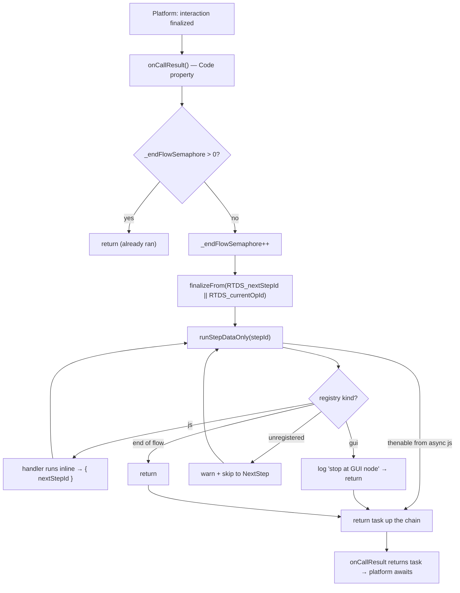

# feat: RTDS execution completion on interaction finalization

## Problem Frame

When a Vocalls interaction terminates (caller hangs up, leg drops, error, or a
transfer hands the call off), the RTDS flow stops wherever it was. Any operations
the routing table placed *after* the caller-facing node — the report `SendEmail`,
the `SendSMS`, attribute writes, an API call — never run. In production flows
(e.g. `DA_KLANTWACHT` in [main_sourceCode.js](../../projects/rtds-runtime/callScripts/main_sourceCode.js))
the call-report SendEmail/SendSMS sit at the *end* of the operation list precisely
so they fire after the conversation; if the caller drops early, those are lost.

The platform provides one termination callback that fires on every end-of-call
path. The user supplied the production idiom for it — an `async` callback guarded
by `_endFlowSemaphore` that calls a finaliser and **returns the awaited task** so
the platform holds teardown until the HTTP resolves:

```javascript
async function onCallResult() {
    if (_endFlowSemaphore > 0) return; else _endFlowSemaphore++;
    KeyLog();            // returns request.then(...), platform awaits
}
```

This plan adds the same shape for **RTDS execution completion**: a termination
callback that resumes the RTDS flow from where it stopped and runs the remaining
**data-only** operations to completion, awaited by the platform.

## Scope

**In scope**
- A reusable runtime engine (`runStepDataOnly` + `finalizeFrom`) in
  `rtds_2_runtime.js` that resumes RTDS dispatch from a step id and runs only
  JS-inline operations, stopping at any caller-facing GUI node.
- A thin `onCallResult()` callback in the Designer master-layer `Code` property
  that calls `finalizeFrom(...)` and returns the resulting task, guarded by
  `_endFlowSemaphore`.
- Unit tests for the engine and the callback's await/idempotency behavior.
- Docs lockstep (runtime-architecture, runtime-spec) per
  [CLAUDE.md](../../CLAUDE.md) "what to update when you change X".

**Out of scope / deferred to follow-up work**
- `KeyLog()` / `SegmentLog()` finalisers — specified separately in
  [logging-design.md](../../rtds/docs/logging-design.md). This plan leaves a clean
  sequential slot for them in `onCallResult` but does not implement them.
- A general mid-flow `goto(nodeId)` primitive callable from inside components —
  conflicts with the `__rtOutcome` staging contract
  ([conventions/anti-patterns.md](../../conventions/anti-patterns.md)); not needed.
- Running caller-facing GUI operations post-call — structurally impossible (no
  live leg); the engine stops and logs instead.

---

## Key Technical Decisions

**1. Separate `runStepDataOnly` rather than a `mode` flag on `runStep`.**
`runStep` ([rtds_2_runtime.js:484](../../projects/rtds-runtime/globalLibraries/active/rtds_2_runtime.js))
is the voice-critical hot path. A new sibling that diverges only in GUI handling
keeps the live-call loop untouched and impossible to mis-trigger post-call. It
reuses the same registry (`RTDS_REGISTRY`), `resolveNextStep`, cycle-guard
(`visited`), and async-handler `.then` chaining the original uses.

**2. GUI nodes are a logged stop, not a handoff.** In `runStep`, a `gui` entry
calls `prepareGuiHandoff` and returns an exit key to route the live call
([rtds_2_runtime.js:617](../../projects/rtds-runtime/globalLibraries/active/rtds_2_runtime.js)).
Post-call there is no leg and the callback's return value is not routed, so
`runStepDataOnly` instead logs `[RTDS] finalize: stop at GUI node` and returns —
the interactive remainder is intentionally dropped.

**3. Return the task so the platform awaits it (the user's core correction).**
`runStepDataOnly` returns the async handler's thenable up the chain (mirroring
`runStep` lines 582–605); `finalizeFrom` returns it; `onCallResult` returns it.
The platform awaits a returned task — exactly as
`result = fetchAndStart(...)` is awaited before the `case` node routes
([main_sourceCode.js node 372](../../projects/rtds-runtime/callScripts/main_sourceCode.js)).
This makes post-call SendSms/SendMail/API POSTs **reliably complete**, not
fire-and-forget. (This upgrades [logging-design.md](../../rtds/docs/logging-design.md)
assumption #4 — flag it in that doc.)

**4. Resume point comes from already-staged session vars.**
`prepareGuiHandoff` writes `RTDS_currentOpId` and pre-populates `RTDS_nextStepId`
([rtds_2_runtime.js:463-469](../../projects/rtds-runtime/globalLibraries/active/rtds_2_runtime.js)).
`onCallResult` resumes from `RTDS_nextStepId || RTDS_currentOpId`. If neither is
set (call ended on a pure JS stretch that already completed), `finalizeFrom`'s
guard no-ops cleanly. No new state-tracking is introduced.

**5. `_endFlowSemaphore` idempotency, mirroring the production reference.** A flat
global int declared in the master-layer `Variables` property, incremented on first
entry, guarding against the platform firing `onCallResult` more than once.

---

## High-Level Technical Design

*This illustrates the intended approach and is directional guidance for review,
not implementation specification. The implementing agent should treat it as
context, not code to reproduce.*



The data-only remainder is authored in the routing-table JSON: the branch that
`RTDS_nextStepId` points at after the last caller-facing node contains only
SetVariables / Condition / SendSMS / SendEmail / API ops and terminates at a node
with no `NextStep` (or a `Disconnect`, which is the natural logged stop).

---

## Implementation Units

### U1. `runStepDataOnly(startOpId)` — data-only dispatch engine

**Goal:** A sibling of `runStep` that runs JS-inline RTDS operations from a start
step and stops (with a log) at any GUI-exit node, returning a thenable when an
async handler is in the chain.

**Dependencies:** none (builds on existing registry + helpers).

**Files:**
- `projects/rtds-runtime/globalLibraries/active/rtds_2_runtime.js` (add function)
- `projects/rtds-runtime/tests/finalize.test.js` (new)

**Approach:**
- Copy the `runStep` loop structure (lines 484–641): read `RTDS_opIndex`, walk
  `currentId`, `visited` cycle guard, `RTDS_REGISTRY.get(type)` lookup.
- `kind === 'js'`: identical to `runStep` — call `entry.handler(current)`, honor
  sync `{ nextStepId }` advance, and the async `result.then(...)` chain that
  recurses into `runStepDataOnly(String(asyncNext))`. Preserve the try/catch and
  `RTDS_error` behavior.
- `kind === 'gui'`: **diverge** — do NOT call `prepareGuiHandoff`. Log
  `Logger.info('[RTDS] finalize: stop at GUI node', { id, type })` and `return`
  (no exit key; nothing routes post-call).
- Unregistered type and end-of-flow: same warn/skip and clean return as `runStep`.
- ES5.1, `var`-only, no new globals. Reuse `resolveNextStep`, `getParam`,
  `RTDS_REGISTRY`, `Logger`.

**Patterns to follow:** `runStep` (rtds_2_runtime.js:484) for loop + async chain;
`resumeFrom` (line 655) for the null/`-1` guard idiom.

**Test scenarios** (`projects/rtds-runtime/tests/finalize.test.js`):
- Happy path: opIndex A(SetVariables)→B(SetVariables)→end. `runStepDataOnly('A')`
  runs both, returns cleanly; assert both writes landed via `setVariable`.
- Async happy path: A(SetVariables)→B(SendSms, mock `jsonHttpRequest` resolving
  `{success:true}`)→end. Returns a thenable that resolves after the POST; assert
  the SendSms payload was built and POSTed once.
- Stop at GUI: A(SetVariables)→B(PlayPrompt, `gui`)→C(SetVariables).
  `runStepDataOnly('A')` runs A, logs `finalize: stop at GUI node` for B, and C
  never runs (`prepareGuiHandoff` not called — assert no `RTDS_currentOp*` writes).
- Unregistered skip: A(unknown type with NextStep=B)→B(SetVariables)→end advances
  past A with a warn and runs B.
- Cycle guard: A(NextStep=A) returns `'disconnect'`-equivalent stop with
  `RTDS_CYCLE_DETECTED`, does not hang.
- Missing opIndex: returns cleanly with the `RTDS_NO_OPINDEX` error set (matches
  `runStep`).

**Verification:** `npm test` green for `finalize.test.js`; `npm run validate`
(ES5.1) passes on the modified library.

### U2. `finalizeFrom(nextStepId)` — guarded entry point

**Goal:** A thin wrapper (mirroring `resumeFrom`) that guards a missing resume
point and returns the `runStepDataOnly` task.

**Dependencies:** U1.

**Files:**
- `projects/rtds-runtime/globalLibraries/active/rtds_2_runtime.js` (add function)
- `projects/rtds-runtime/tests/finalize.test.js` (extend)

**Approach:**
- Mirror `resumeFrom` (line 655): if `nextStepId` is `undefined`/`null`/`''`/`-1`,
  `log_warn('[RTDS] finalizeFrom: no resume point -- nothing to finalize.')` and
  return (no thenable). Otherwise
  `Logger.info('[RTDS] finalizing', { from: String(nextStepId) })` and
  `return runStepDataOnly(String(nextStepId))`.

**Patterns to follow:** `resumeFrom` (rtds_2_runtime.js:655) verbatim in shape.

**Test scenarios:**
- Null/empty/`-1` resume point → returns falsy, logs the no-op warn, does not call
  the engine (spy on `runStepDataOnly`).
- Valid step id → delegates to `runStepDataOnly` and returns its result.

**Verification:** `npm test` green; both guard and delegate paths covered.

### U3. `onCallResult()` callback wired into the master-layer `Code` property

**Goal:** The platform-facing termination callback: guarded, resumes the
data-only remainder, returns the task so the platform awaits it.

**Dependencies:** U1, U2.

**Files:**
- `projects/rtds-runtime/callScripts/main_sourceCode.js` (master-layer `Code`
  property at the `vocalls-master-layer` object; add `_endFlowSemaphore` to the
  `Variables` property)

**Approach:**
- Master-layer `Variables` already declares `result`, `env`, `_rtNextStep`, etc.
  Add `_endFlowSemaphore = 0;`.
- Master-layer `Code` property (currently `Code=""`) gets `onCallResult`:
  ```javascript
  async function onCallResult() {
      if (_endFlowSemaphore > 0) return; else _endFlowSemaphore++;
      var resumeAt = context.session.variables.RTDS_nextStepId
                  || context.session.variables.RTDS_currentOpId;
      return finalizeFrom(resumeAt);   // returns the awaited task (or undefined)
      // Sequential finaliser slot (separate effort): KeyLog(); SegmentLog();
  }
  ```
  *(Directional — the implementer matches the exact callback name the platform
  invokes; the user's reference uses `onCallResult`. Confirm against the platform
  contract; `onCallEnd` is the name in logging-design.md. Use whichever the
  platform actually fires and note it in runtime-spec.)*
- ES5.1 note: the production reference uses `async function`; the repo sandbox
  flags `async`/`await` ([core/minimalVocallsCore.js](../../core/minimalVocallsCore.js)).
  The callback does not need `async` — it `return`s a thenable directly. Drop
  `async` to stay ES5.1-clean unless the platform requires the keyword (decide at
  implementation; the reference suggests the platform tolerates it). Document the
  choice.

**Patterns to follow:** the user-supplied `onCallResult`/`KeyLog` idiom; the
existing `result = fetchAndStart(...)` await contract at node 372.

**Test scenarios:** behavior is covered at the engine level (U1/U2). For the
callback itself, a focused harness test in `finalize.test.js`:
- First invocation with `RTDS_nextStepId` set → returns the finalize task,
  increments `_endFlowSemaphore`.
- Second invocation → returns immediately (semaphore guard), engine not re-run.
- Neither resume var set → returns cleanly, no engine call.
- Await ordering: with a deferred SendSms mock, the returned promise does not
  resolve until the POST resolves (proves the platform-await contract). `Covers`
  the core requirement.

**Verification:** `npm test` green; manual read of the Designer `Code`/`Variables`
properties confirms the wiring; `npm run validate` passes.

### U4. Docs lockstep

**Goal:** Keep architecture/spec docs in step with the new runtime surface, per
CLAUDE.md.

**Dependencies:** U1–U3.

**Files:**
- `rtds/docs/runtime-architecture.md` (document `finalizeFrom` / `runStepDataOnly`
  and the data-only stop-at-GUI rule alongside the two existing entry points)
- `rtds/docs/runtime-spec.md` (add "Entry point C: onCallResult finalization" with
  the resume-var contract and the return-awaits-task behavior)
- `rtds/docs/logging-design.md` (note that assumption #4 is upgraded: finalisers
  returned from the callback are awaited, not fire-and-forget)

**Approach:** Prose + a one-line addition to the two-entry-point list in
runtime-architecture's "Two entry points" section. No code.

**Test expectation: none — documentation only.**

**Verification:** `npm run check` (lockstep/mechanical checks) passes; docs read
consistently with the implemented functions.

---

## System-Wide Impact

- **Routing-table authors / seeds:** flows that want post-call completion must
  place data-only ops after the caller-facing node and ensure the `NextStep`
  chain reaches them. No schema change; an authoring convention to document in
  runtime-spec.
- **Live-call path:** untouched. `runStep`/`resumeFrom`/`prepareGuiHandoff` are
  read-from but not modified; the new functions are only invoked at termination.
- **Platform contract:** depends on the platform invoking the termination
  callback and awaiting its returned task. The user confirmed the await behavior;
  the exact callback name (`onCallResult` vs `onCallEnd`) is verified at U3.

---

## Verification (end-to-end)

1. **Unit:** `npm test` — `finalize.test.js` covers U1/U2/U3 scenarios above,
   especially the await-ordering test (returned promise resolves only after the
   mocked SendSms POST resolves) and the semaphore idempotency test.
2. **ES5.1:** `npm run validate` passes on the modified library and the Designer
   source (no `let`/`const`/arrow/spread; `async` decision from U3 honored).
3. **Lockstep:** `npm run check` passes after U4.
4. **Simulator:** `npm run simulate` on a flow whose routing table has
   `... → PlayPrompt(GUI) → SetVariables → SendSMS → Disconnect`. Drive it so the
   call "stops" at the PlayPrompt, then invoke the termination path and confirm
   the trace shows `[RTDS] finalizing`, the SetVariables/SendSMS executing, and
   `[RTDS] finalize: stop at GUI node` if a second GUI node is reached. Confirm the
   SendSMS POST is observed (via the flow-sim HTTP stub) before the callback's task
   resolves.
