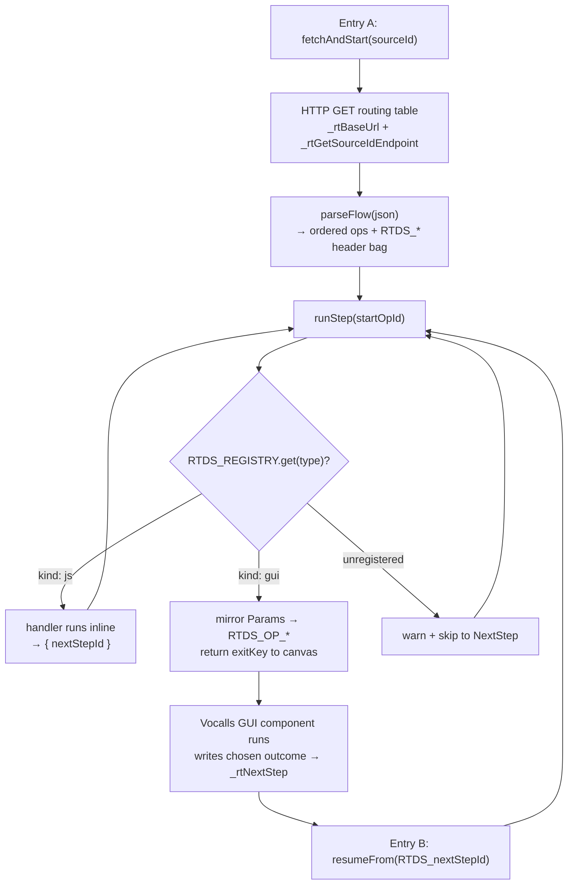

# RTDS Runtime Architecture

How the committed reference runtime under
[`projects/rtds-runtime/`](../../projects/rtds-runtime/) is wired together: the three
global libraries, the dispatch engine, and the contract between JS-handled operations and
the Vocalls canvas.

This document describes **structure and control flow**. It does not restate the coding
rules — storage, logging, casing, reads, and ES5.1 live in
[PROJECT_CONVENTIONS.md](../../PROJECT_CONVENTIONS.md). For the field-level contract
(Params keys, endpoint URLs, exit keys, payload shapes) see the companion
[runtime-spec.md](runtime-spec.md). For the per-operation inventory see
[operations-catalog.md](operations-catalog.md).

## The three global libraries (load order 3 → 2 → 1)

The libraries live in
[`projects/rtds-runtime/globalLibraries/active/`](../../projects/rtds-runtime/globalLibraries/active/)
and are loaded by the platform in **reverse-alphabetical filename order**, which is also the
dependency order:

| Order | File | Responsibility |
| ----- | ---- | -------------- |
| 1st (loaded) | `rtds_3_vocallsEnv.js` | Platform/runtime layer, **not** RTDS-specific. Object-access helpers (`getOrDefault`, `getValue`, `hasKey`, `walk`, `getScoped`, `nowUTC`, …), the `Logger` facade (`debug/info/warn/error/API/configure`), and lifecycle hooks `initializeCallFlowContext(mode)` / `storeSessionVariables()`. Everything declared without `var/let/const` lands on the global scope. |
| 2nd | `rtds_2_runtime.js` | The RTDS dispatch engine. Depends on `Logger` + `getValue` from the env library. Owns the registry, flow parsing, and the run loop. |
| 3rd (loaded last) | `rtds_1_globalConfig.js` | Per-project shape file: `DEFAULT_LOGGED_KEYS` and `constVarObj()` (the call-scoped `varObj` schema). Consumed at runtime, not at parse time, so its late load is fine. |

The numeric suffix encodes the order: `rtds_3_…` sorts highest in the `rtds_` family (loaded
first), `rtds_1_…` sorts lowest (loaded last). When editing, preserve this invariant.

## Dispatch model (`rtds_2_runtime.js`)

### Registry

Every operation Type is registered into a single map, `RTDS_REGISTRY`, as one of two kinds:

- **`js`** — a handler that runs **inline** and returns `{ nextStepId }`. Registered via
  `registerRtdsOperation(type, handler)`.
- **`gui`** — a Vocalls component on the canvas, reached via an **exit key**. Registered via
  `registerRtdsExit(type, exitKey)`. The runtime stops and hands the call off to the GUI.

`RTDS_OPERATIONS` (Type → handler) and `RTDS_EXIT_KEYS` (Type → exit key) are kept as
**read-only views** over `RTDS_REGISTRY` for back-compat. Only real handlers are registered;
a Type with no handler yet stays unregistered and `runStep` skips it to its `NextStep` with a
warning (no mock advancers).

### Two entry points

```
Entry A — initial call:   return fetchAndStart(RTDS_sourceId)
Entry B — GUI re-entry:    return resumeFrom(RTDS_nextStepId)
```

### Control flow



- **`fetchAndStart(sourceId)`** — fetches the routing table over HTTP
  (`jsonHttpRequest` against `_rtBaseUrl` + `_rtGetSourceIdEndpoint`, with `_headers`), then
  `parseFlow` → `runStep`.
- **`parseFlow(json)`** — turns the routing-table JSON into an ordered op list and writes the
  `RTDS_*` header bag (sourceId, name, project, promptLibrary, supportedLanguages) into the
  session.
- **`runStep(startOpId)`** — the loop. For each op it looks up the registry: a `js` entry runs
  inline and the loop advances to the returned `nextStepId`; a `gui` entry stops the loop.
- **`resumeFrom(nextStepId)`** — re-entry after a GUI node completes; resumes `runStep` at the
  step the component selected.
- **`getParam(op, name, fallback)`** — case-insensitive Param read on the runtime side
  (mirrors `getValue`/`hasKey` on the component side; see
  [casing](../../conventions/casing.md)).

## JS-inline vs GUI-exit, and `_rtNextStep`

- **JS-inline** operations (e.g. `SetVariables`, `SendSms`, `SendMail`) execute entirely in the
  runtime and return `{ nextStepId }`; the loop never leaves `rtds_2_runtime.js`.
- **GUI-exit** operations mirror their Params into `RTDS_OP_<Key>` session variables and return a
  Type-specific **exit key** string to Vocalls. The matching canvas component runs, writes its
  chosen outcome Id into the master-layer global **`_rtNextStep`**, and the call re-enters through
  `resumeFrom(RTDS_nextStepId)`.

A GUI component and its JS twin (where both exist) must keep the **same payload + branch
contract** — this is the lockstep rule (see [lockstep](../../conventions/lockstep.md)). Three
twins exist today: `executeSendSms` / `executeSendEmail` / `executeSetVariables` in
`rtds_2_runtime.js` alongside `rtds/components/sendSms.js` / `sendMail.js` / `setVariables.js`.

## The `varObj` store

Call-scoped user data lives on the global **`varObj`**, whose schema is `constVarObj()` in
`rtds_1_globalConfig.js`. `initializeCallFlowContext(mode)` builds a fresh `varObj` once per
call leg.

- **Reads:** `getScoped(key, default)` resolves `varObj` → global → default.
- **Writes:** `setVariable(path, value)` — a bare key targets `varObj`; a dotted path can target
  `globalThis` or a named reachable object, auto-creating intermediates and preserving native
  type. This is what `SetVariables` (and its component twin) uses.

Storage rules (where data belongs, the `_rt*` prefix for new runtime globals) are in
[storage](../../conventions/storage.md).

## Logging

`Logger` (defined in `rtds_3_vocallsEnv.js`) is the only sanctioned logging surface:
`Logger.debug / info / warn / error / API`, each taking a message plus a structured context
object. `DEFAULT_LOGGED_KEYS` (in `rtds_1_globalConfig.js`) lists the `varObj` attributes
auto-included in default log payloads. Never call bare `log_*` outside the Logger
implementation — see [logging](../../conventions/logging.md).

## Required platform globals

`rtds_2_runtime.js` assumes these are provided by `rtds_3_vocallsEnv.js` and the Vocalls
platform: `log_debug`, `log_warn`, `log_error`, `jsonHttpRequest`, `_headers`, `_rtBaseUrl`,
`_rtGetSourceIdEndpoint`.

## ES5.1 sandbox

All runtime and component code runs in the Vocalls ES5.1 sandbox: no `let`/`const`/arrow/
async/spread/destructuring and no string-eval (`new Function`). Template literals are allowed.
See [es5](../../conventions/es5.md).
